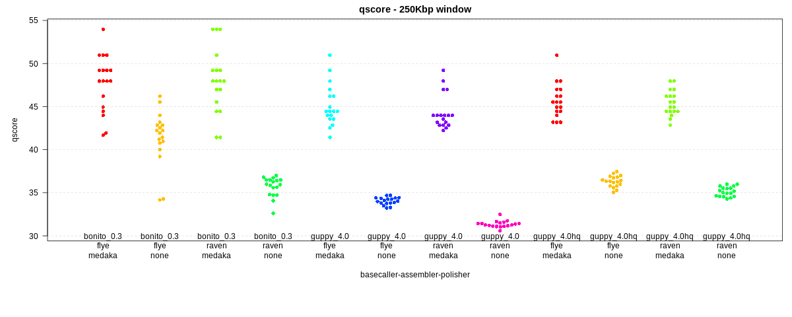
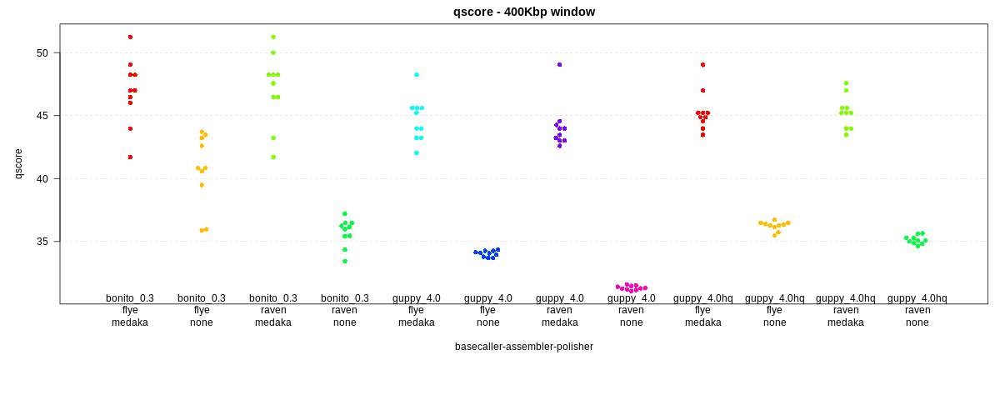

# Nanopore basecallers and assemblers
## Benchmarking basecallers and assemblers using *E. coli* K12

This repo compares *E. coli* K12 assemblies (for now, `raven` and `flye`) 
using data from different basecallers (`guppy` and `bonito`). One set of `guppy` 
basecalls have been filtered (*hq*) using `filtlong` to retain the highest quality 
reads (quality weighting of 10 to retain at least 500Mbp) using `filtlong --mean_q_weight 10 --target_bases 500000000 myreads.fastq > myreads_hq.fastq`.
Note that `bonito` does not produce quality scores (although there may be ways around that such that read q-scores can be inferred).

Each assembly is polished using `medaka` (or not).

The results of each assembly is compared to the K12 reference using `dnadiff` from `mummer`, 
and the quality of the assembly is assessed by
error per window across the genome. This is plotted as a phred-based q-score (e.g. q50 means 1 error every 100,000 base pairs).

First, a plot using 250 Kbp windows. Max q-score here is 54 ( log10(2.5e5)\*10 ). The `raven` and `flye` assemblies basecalled with `bonito` 
and with `medaka` polishing come out *very very* close, at around q49 (1.2 errors every 100Kbp). Notably, there are three 250Kbp windows in 
the `raven` assembly that have *no errors at all*. This suggests that with `bonito`, ONT may be closing in on the q60 *E. coli* genome (i.e. 
less than one error per Mbp), which is one of the harder microbes to accurately assemble. 

Also interesting is that the `guppy` basecalled assemblies do not come far behind the `bonito` assemblies, around 45.5 (2.8 errors every 100Kbp). However, this 
means that on average, for a 5Mbp genome, there are close to 150 errors (with the vast majority being indels). 
This contrasts with the `bonito` assemblies, which are closer to 60 errors - and with two 250Kbp windows containing more than 30 of those errors.

Second, using 400 Kbp windows. Here, max q-score is 56, and there are no windows without errors.

