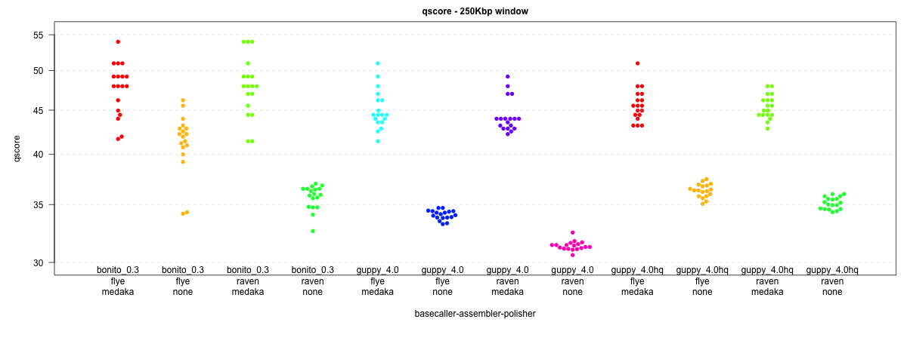

# bonito_benchmarks
## Benchmarking bonito basecaller using E. coli assemblies

This repo compares *E. coli* K12 assemblies (for now, `raven` and `flye`) using data from different basecallers (`guppy` and `bonito`). One set of `guppy` basecalls have been filtered (*hq*) using `filtlong` ot retain the highest quality reads (quality weighting of 10 to retain at least 500Mbp)

Each assembly is polished using `medaka` (or not).

The results of each assembly is compared to the K12 reference, and the quality of the assembly is assessed by
error per window across the genome. This is plotted as a phred-based q-score (e.g. q50 means 1 error every 100,000 base pairs).

As is apparent below, the `raven` and `flye` assemblies basecalled with `bonito` and with `medaka` polishing come out *very very* close, at around q49 (1.2 errors every 100Kbp). Notably, there are three 250Kbp windows in the `raven` assembly that have *no errors at all*.

Also interesting is that the `guppy` basecalls do not come far behind `bonito`, around 45.5 (2.8 errors every 100Kbp). 

