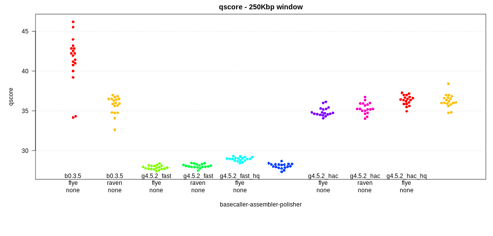
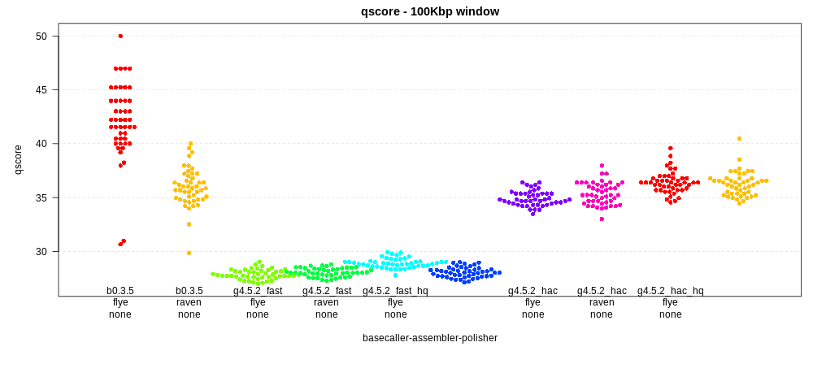
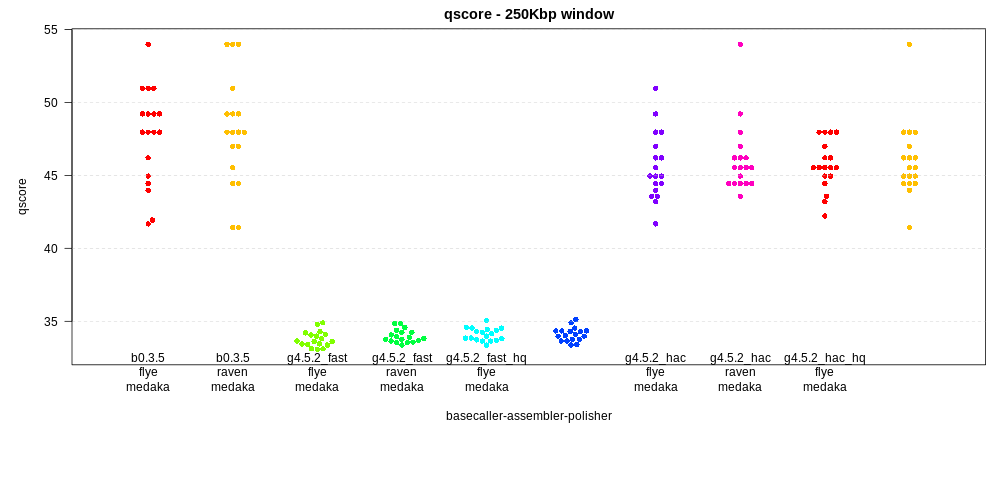
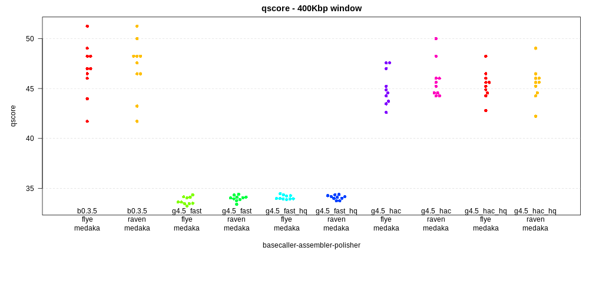

# Nanopore basecallers and assemblers
## Benchmarking basecallers and assemblers using *E. coli* K12

This repo compares *E. coli* K12 assemblies (for now, `raven` and `flye`) 
using data from different basecallers (`guppy 4.5.2` and `bonito 0.3.5`). One set of `guppy` 
basecalls have been filtered (*hq*) using `filtlong` to retain the highest quality 
reads (quality weighting of 30 to retain at least 500Mbp) using 
`filtlong --mean_q_weight 30 --target_bases 500000000 myreads.fastq > myreads_hq.fastq`.
Note that `bonito` does not produce quality scores (although there may be 
ways around this such that read q-scores can be inferred).

Each assembly is polished using `medaka` (or not).

The results of each assembly is compared to the K12 reference using `dnadiff` from `mummer`, 
and the quality of the assembly is assessed by
calculating the SNPs (i.e. short indels and subsitutions) per window across the genome. 
This is plotted as a phred-based q-score 
(e.g. q50 means 1 error every 100,000 base pairs).

### No polishing
First, the results with no polishing at all ("none"). Each point in the plot 
below indicates the quality score within a 250 Kbp window. `bonito 0.3.5` is 
indicated as *b0.3*; `guppy 4.5.2` is indicated as *g4.0*. There are two 
models for guppy, *fast* (fast) amd *high accuracy* (hac). In addition, for 
each set of `guppy` basecalls with `.fastq` scores, there is a matching dataset
that has been filtered for high quality (hq) reads using `filtlong` as indicated above.

In a 250 Kbp windown, the maximum q-score is 54 ( log10(2.5e5)\*10 ). (actually this 
is the score for a window with one error. I don't know how to score a window with no errors)
For some additional 
intution on scores for the 250Kbp-windowed plot below:

| q-score | errors per 250Kbp |
|:--------|:------------------|
| 51      | 2                 |
| 47      | 5                 |
| 44      | 10                |
| 41      | 20                |
| 37      | 50                |
| 34      | 100               |
| 27      | 500               |

The `flye` assembly basecalled with `bonito` is 
the clear winner. However, during `flye` assembly there is a polishing step built-in.
All the assemblies using fast basecalling are relatively poor, with q-scores well below 30. The *hac* reads 
are considerably higher, and the *hac* reads filtered for quality by `filtlong` are a tad higher still.

Given the relatively large number of errors for these unpolished genomes, it's also possible to plot
q-scores over 100Kbp pair windows, shown below. This yields slightly more information on the relative 
quality of different assemblies as there are more points for each.

### With polishing
With `medaka` polishing, the `flye` and `raven` `bonito` assemblies come 
out *very very* close, at around q49 (3 errors every 250Kbp). Notably, there are three 250Kbp windows in 
the `raven` assembly that have *no errors at all*. This suggests that with 
`bonito`, ONT may be closing in on the q60 *E. coli* genome (i.e. 
less than one error per Mbp), which is one of the harder microbes to accurately assemble. 

Also interesting is that the `guppy` basecalled assemblies do not 
come far behind the `bonito` assemblies, around 46 (6 errors every 250Kbp),
and perhaps slightly higher for the `filtlong`-filtered data (compare, 
especially, the `flye` assemblies polished with `medaka` for the 
unfiltered and `filtlong` filtered 
*hq* data. However, this 
means that on average, for a 5Mbp genome, there are close to 150 
errors (with the vast majority being indels). 
This contrasts with the `bonito` assemblies, which are closer to 
60 errors - and with two 250Kbp windows containing more than 30 of those errors.

Again, it is clear that the fast basecalled assemblies end up far below all others, 
with q-scores around 34 (100 errors per 250Kbp). 

Here, given the small number of errors in some assemblies, it is 
not useful to plot 100Kbp windows, as *many many* of these windows 
have no errors and a perfect q-score of 50. Instead, the results 
using 400 Kbp windows are shown below. Here, max q-score is 56, and 
there are no windows without errors, although in the `raven` assembly, 
there is one window with 3 errors (q-score 51.2) and one with 4 (q-score 50).

