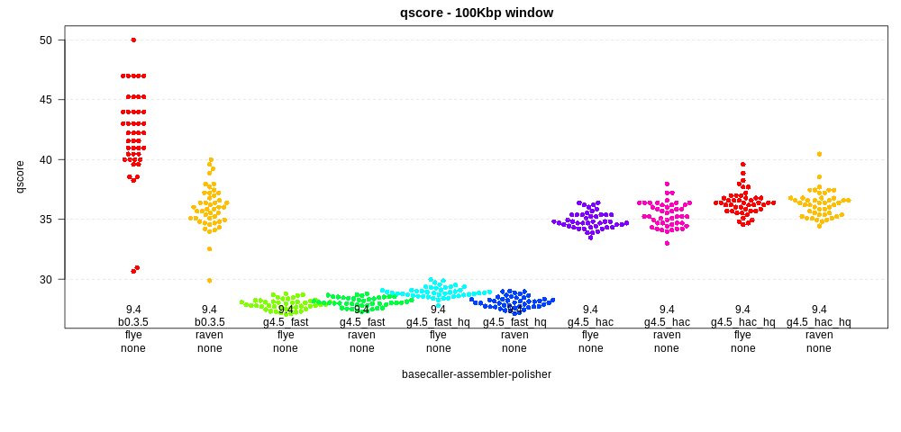
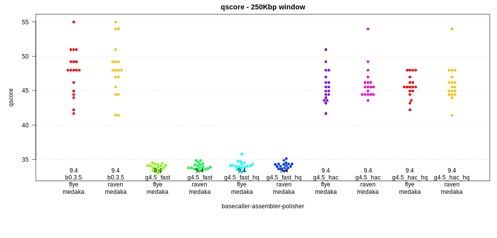
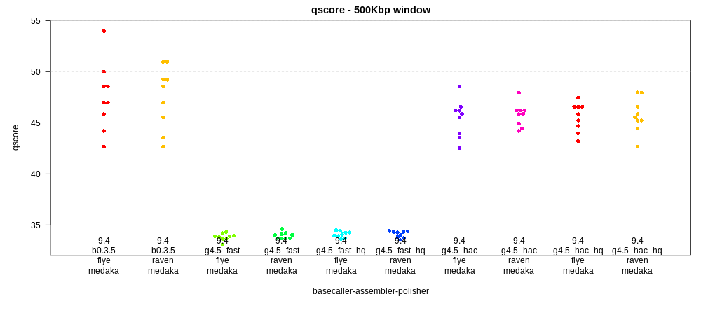
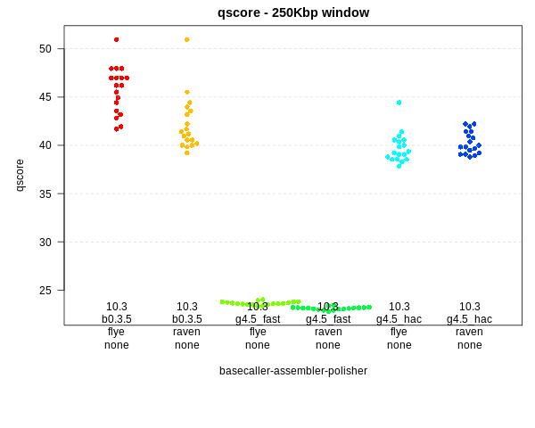
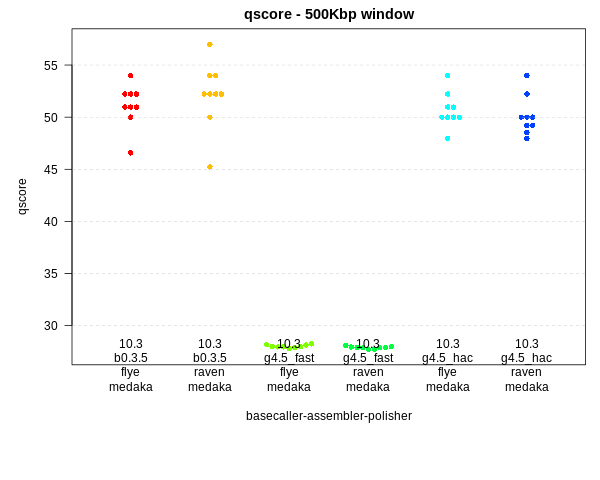

# Nanopore basecallers and assemblers
## Benchmarking basecallers and assemblers using *E. coli* K12

This repo compares *E. coli* K12 assemblies (for now, [raven](https://github.com/lbcb-sci/raven) 
and [flye](https://github.com/fenderglass/Flye)) 
using data from different flowcells chemistries (9.4 and 10.3) and 
basecallers (`guppy 4.5.2` and `bonito 0.3.5` [here](https://github.com/nanoporetech/bonito)). 
One set of 9.4 `guppy` 
basecalls have been filtered (*hq*) using [filtlong](https://github.com/rrwick/Filtlong) 
to retain the highest quality 
reads (quality weighting of 30 to retain at least 500Mbp) using 
`filtlong --mean_q_weight 30 --target_bases 500000000 myreads.fastq > myreads_hq.fastq`. 
For the 10.3 chemistry, we did not have enough data to filter. 
Note that `bonito` does not produce quality scores (although there may be 
ways around this such that read q-scores can be inferred).

Each assembly is polished using [medaka](https://github.com/nanoporetech/medaka) (or not).

The results of each assembly is compared to the K12 reference using `dnadiff` 
from [mummer](https://github.com/garviz/MUMmer), 
and the quality of the assembly is assessed by
calculating the SNPs (i.e. short indels and subsitutions) per window across the genome. 
This is plotted as a phred-based q-score 
(e.g. q50 means 1 error every 100,000 base pairs).

### Notes on data

The 9.4 data was produced several years ago by our lab.

The 10.3 data was kindly pointed out to me by [Mari Miyamoto](https://twitter.com/marimiya_tky) 
and was collected
by [Rasmus Kirkegaard](https://github.com/Kirk3gaard) in the 
[Albertsen lab](https://albertsenlab.org), with an analysis in
an accompanying blogpost [here](https://albertsenlab.org/we-ar10-3-pretty-close-now/)

### Notes on errors
For most plots below, I plot errors in the assembly over 250Kbp windows (or 500Kbp).
In a 250 Kbp window, the maximum q-score is 54 ( log10(2.5e5)\*10 ). (actually this
is the score for a window with one error. Below, for windows with no errors, I assign
a q-score of the (max + 1)).
Thus, within 250Kbp-windows, q-scores and associated errors would be:

| q-score | errors per 250Kbp |
|:--------|:------------------|
| 55      | 0                 |
| 54      | 1                 |
| 51      | 2                 |
| 47      | 5                 |
| 44      | 10                |
| 41      | 20                |
| 37      | 50                |
| 34      | 100               |
| 27      | 500               |

## 9.4 Flowcells

### No polishing
First, the results for 9.4 flowcells with no polishing at all ("none"). Each point in the plot 
below indicates the quality score within a 250 Kbp window. `bonito 0.3.5` is 
indicated as *b0.3.5*; `guppy 4.5.2` is indicated as *g4.5*. There are two 
models for guppy, *fast* (fast) amd *high accuracy* (hac). In addition, for 
each set of `guppy` basecalls with `.fastq` scores, there is a matching dataset
that has been filtered for high quality (hq) reads using `filtlong` as indicated above.

The `flye` assembly basecalled with `bonito` is 
the clear winner. However, during `flye` assembly there is a polishing step built-in, so it's noit quite 
a fair competition.
All the assemblies using fast basecalling are relatively poor, with q-scores well below 30. The *hac* reads 
are considerably higher, and the *hac* reads filtered for quality by `filtlong` are a tad higher still.

Given the relatively large number of errors for these unpolished genomes, it's also possible to plot
q-scores over 100Kbp pair windows, shown below. This yields slightly more information on the relative 
quality of different assemblies as there are more points for each.

### With polishing
With `medaka` polishing, the `flye` and `raven` `bonito`-basecalled assemblies come 
out *very very* close, at around q49 (3 errors every 250Kbp). Notably, there is one 250Kbp windows in 
the `raven` assembly that has *no errors at all* (q55), and two windows that have one error (q54). 

Also interesting is that the `guppy` basecalled assemblies do not 
come far behind the `bonito` assemblies, around 46 (6 errors every 250Kbp),
and perhaps slightly higher for the `filtlong`-filtered data (compare, 
especially, the `flye` assemblies polished with `medaka` for the 
unfiltered and `filtlong` filtered 
*hq* data. However, this 
means that on average, for a 5Mbp genome, there are close to 150 
errors (with the vast majority being indels). 
This contrasts with the `bonito` assemblies, which are closer to 
60 errors - and with two 250Kbp windows containing more than 30 of those errors.

Again, it is clear that the fast basecalled assemblies end up far below all others, 
with q-scores around 34 (100 errors per 250Kbp). 

Here, given the small number of errors in some assemblies, it is 
not useful to plot 100Kbp windows, as *many many* of these windows 
have no errors and a perfect q-score of 50. Instead, the results 
using 500 Kbp windows are shown below. Here, max q-score is 57, and 
while there are no windows without errors, in the `flye` assembly 
there is one window with 2 errors (q54).

## 10.3 Flowcells

### No polishing

The 10.3 chemistry has been designed with the thought there will be fewer indels.
Oxford Nanopore have clearly done a good job here - even *unpolished*
`bonito`-basecalled assemblies haved q-scores well above 40, and in the case of `flye`
(which implements its own polishing), the q-scores are well above 45. This "unpolished"
assembly is *approximately equivalent* to the **9.4** `flye` assembly *with* `medaka` polishing.

### With polishing

But the assemblies that really begin to shine are the **10.3** 
`medaka`-polished ones (both `bonito` *and* `guppy`, and for both `raven` and `flye`). 
For `bonito` basecalls, *six* (`raven`) and *four* (`flye`) 250Kbp windows have 
no errors at all (q55), and an additional four have only one error (q54). 
Having said that, there is one window in each of these assemblies that has a very large 
number of errors, in fact more than any one winodw of the `guppy`-based assemblies. 

Notably, for 
`guppy` *high accuracy* (hac) basecalls, a very large fraction of 250Kbp windows also have no or one errors.

But the *fast* `guppy` basecalls still wallow a bit in the mud, with polishing only pushing 
their assembly qualities up a smidge.

Because these assemblies seem so darn accurate, we can also make a plot with 500Kbp windows.
Although now there are no error-free windows, the majority have one (q57), two (q54), or three (q52) 
errors, especially in the case of `raven`.

Finally, it looks like the `raven` assembly, basecalled wqith `bonito`, and polished with `medaka` 
is the winning method, at least for this data and this organism.

A last and important note here (if you have read this far) is that I am not positive that the 10.3
data is from a clone that is identical to the MG1655 reference sequence from Genbank
(looking at you *Rasmus*). For the 9.4
data, I am comparing to a ground truth reference (our lab strains, which in fact differs from the 
Genbank reference by about 7 SNPs).

